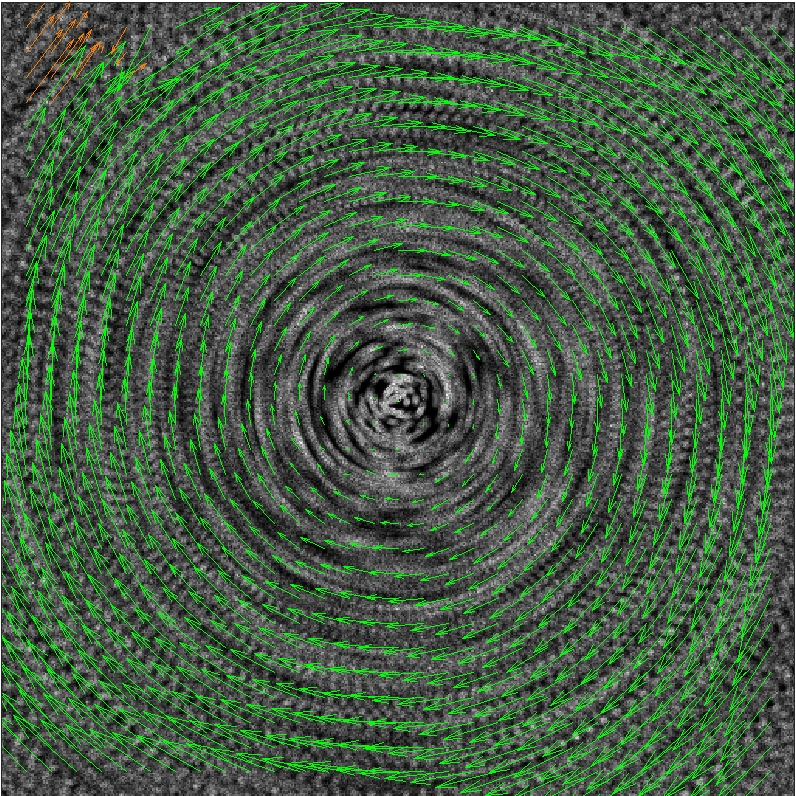
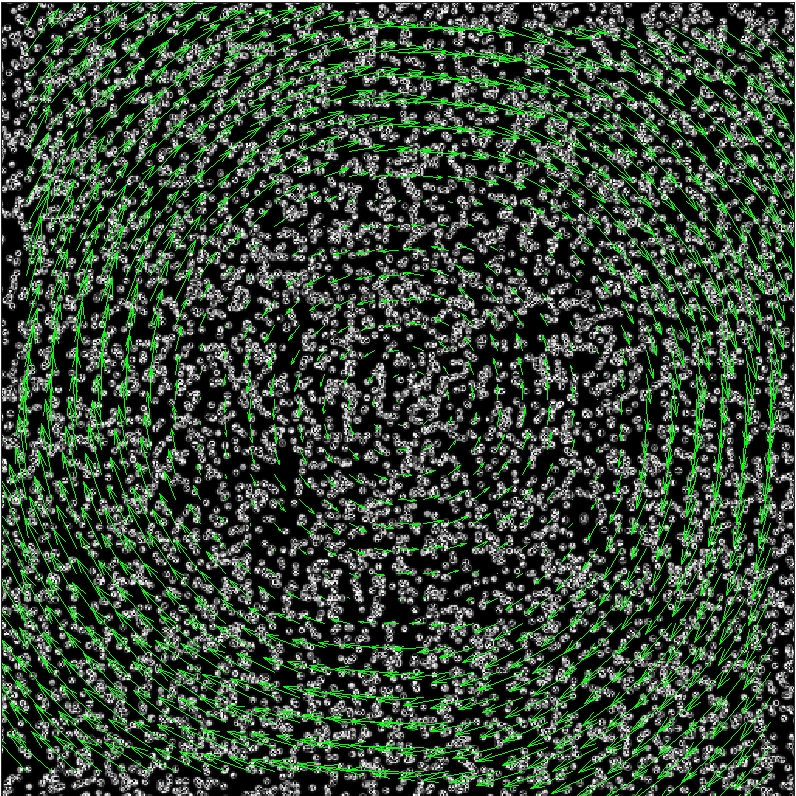
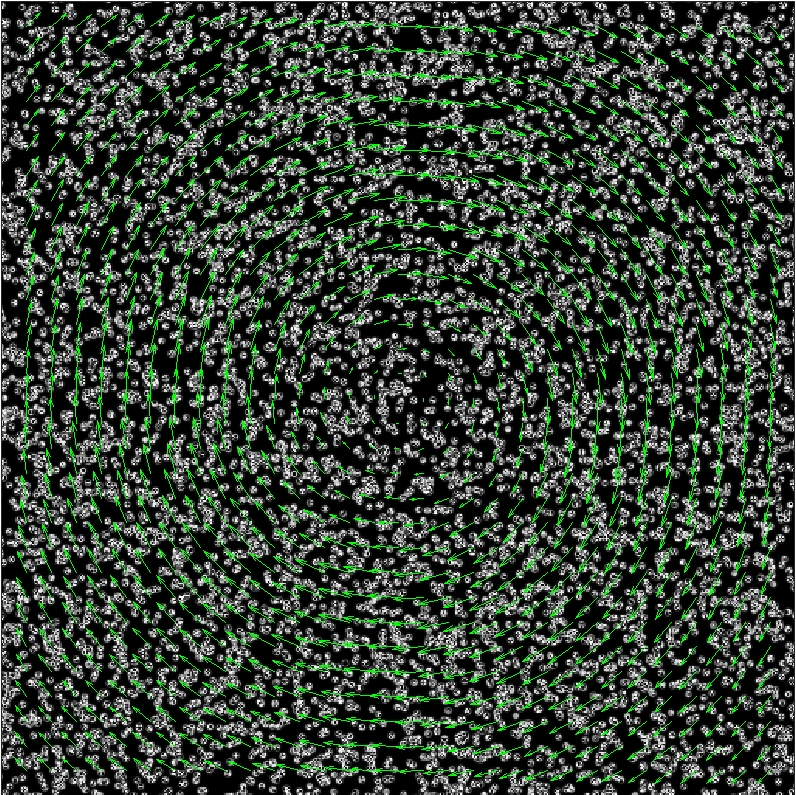

# PIV第二次上机报告
## 报告要求


## 第一部分：模拟低频粒子图像数据

使用提供的低频PIV图像进行流场分析，选取所有的图片进行流场分析，得到其瞬时速度；因其为低频数据，因而需要使用 _1-2, 3-4_ 的序列进行相关性分析。使用开源软件[PIVLab](https://github.com/Shrediquette/PIVlab)对图片进行处理来得到流场，开始图像前处理、分析、以及速度场的后处理，求出瞬时速度场制作为动图；动图的制作使用[ImageMagick](https://imagemagick.org/)提供的convert命令`convert "*.jpg" all.gif`。下边是各种情形的瞬时速度场：


<div align=center>


</div>
<div align=center>各类型流动的瞬时流场</div>

## 第二部分：三种方法求平均速度场
### Image Average
首先需要对一定数量的图像取平均值，这里采用matlab对图像进行平均操作并输出为图片；图像求平均值的函数为：(图片存储在INPUT文件夹下，自定义fileName可读取不同的case，设置totalNum可设置平均帧的数量)
```matlab
fileName = 'Crack expansion';
frame1 = zeros([512, 512]);
frame2 = zeros([512, 512]);
totalNum = 25;
for i=1:totalNum
    frame1 = frame1 + single(imread(['INPUT/', fileName, '/B', num2str(2*i-1, '%.5d'), '.tif']))./totalNum;
    frame2 = frame2 + single(imread(['INPUT/', fileName, '/B', num2str(2*i, '%.5d'), '.tif']))./totalNum;
end


imwrite(uint8(frame1), ['INPUT/', fileName, '/frame1.tif']);
imwrite(uint8(frame2), ['INPUT/', fileName, '/frame2.tif']);
```
通过这个得到的结果如下图(左图均为10个帧平均，右图均为25帧平均)：
<div align=center>


</div>
<div align=center>通过平均图像法得到的Circular Shear Zone的平均速度场</div>

<div align=center>


</div>
<div align=center>通过平均图像法得到的的Crack Expansion平均速度场</div>

<div align=center>


</div>
<div align=center>通过平均图像法得到的Homogeneous Deformation的平均速度场</div>

<div align=center>


</div>
<div align=center>通过平均图像法得到的Oseen Vortex的平均速度场</div>

<div align=center>


</div>
<div align=center>通过平均图像法得到的Rigid Rotation的平均速度场</div>

<div align=center>


</div>
<div align=center>通过平均图像法得到的Vertical Shear Zone的平均速度场</div>

可以看到，针对不同的情况，选取不同数量的图像做平均会有不同的效果，如Ossen Vortex的情形，我们可以看到在25张图片平均的时候会保持较好的效果，但是其他情形下25张图片平均会导致更多的信息丢失导致需要插值的速度矢量增多。

### Correlation Average

[PIVLab](https://github.com/Shrediquette/PIVlab)还提供了在速度场分析的时候通过平均的互相关函数来求得平均速度场的方法，这里使用其来分析平均速度场：
<div align=center>

</div>
<div align=center>通过平均互相关函数法得到的Circular Shear Zone的平均速度场</div>

<div align=center>

</div>
<div align=center>通过平均互相关函数法得到的的Crack Expansion平均速度场</div>

<div align=center>

</div>
<div align=center>通过平均互相关函数法得到的Homogeneous Deformation的平均速度场</div>

<div align=center>

</div>
<div align=center>通过平均互相关函数法得到的Oseen Vortex的平均速度场</div>

<div align=center>

</div>
<div align=center>通过平均互相关函数法得到的Rigid Rotation的平均速度场</div>

<div align=center>

</div>
<div align=center>通过平均互相关函数法得到的Vertical Shear Zone的平均速度场</div>

个人认为是获得了比平均图像法相对更好的结果。。。

### Vector Average

[PIVLab](https://github.com/Shrediquette/PIVlab)还可以瞬时速度场分析后通过对速度矢量求平均来得到平均速度场，求平均的过程可直接从其中获得：

<div align=center>

</div>
<div align=center>通过平均互相关函数法得到的Circular Shear Zone的平均速度场</div>

<div align=center>

</div>
<div align=center>通过平均互相关函数法得到的的Crack Expansion平均速度场</div>

<div align=center>

</div>
<div align=center>通过平均互相关函数法得到的Homogeneous Deformation的平均速度场</div>

<div align=center>

</div>
<div align=center>通过平均互相关函数法得到的Oseen Vortex的平均速度场</div>

<div align=center>

</div>
<div align=center>通过平均互相关函数法得到的Rigid Rotation的平均速度场</div>

<div align=center>

</div>
<div align=center>通过平均互相关函数法得到的Vertical Shear Zone的平均速度场</div>

实际上得到的和平均互相关函数法得到的较为类似，但是本身其经过了一次筛选的过程，可能相对而言使用效果较平均互相函数较差。