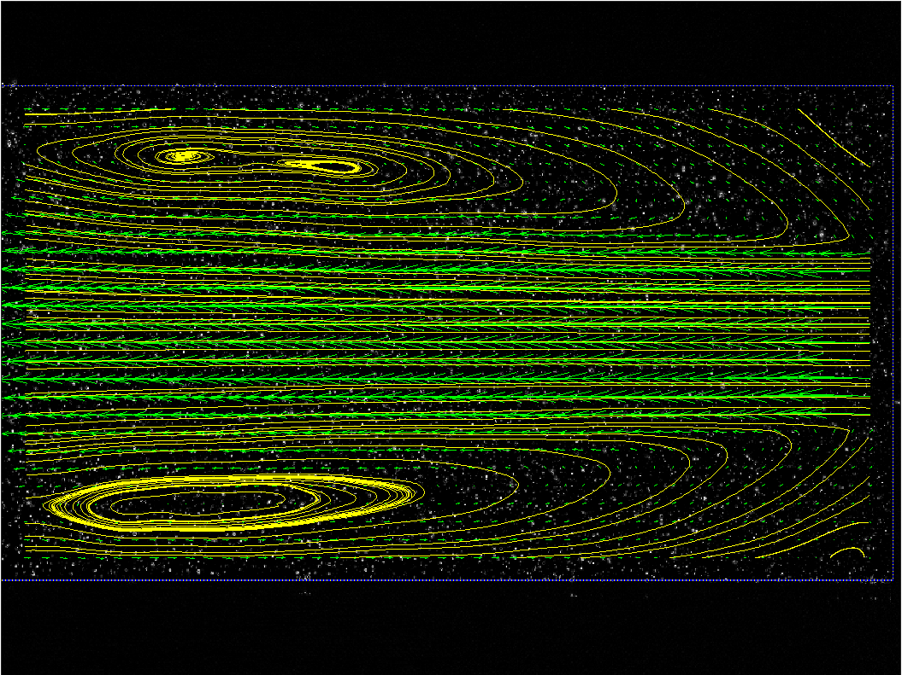
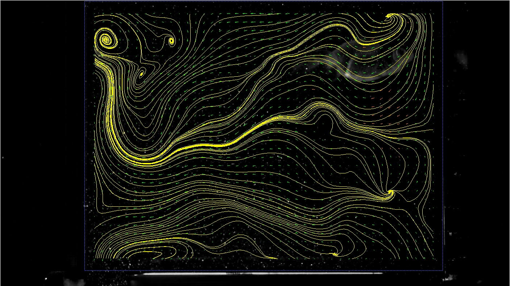

# PIV第三次上机报告
## 报告要求


## 孔板流动部分

使用提供的Orifice的低频PIV图像进行流场分析，选取所有的约500张图片进行流场分析，因其为低频数据，因而需要使用 _1-2, 3-4_ 的序列进行相关性分析。使用开源软件[PIVLab](https://github.com/Shrediquette/PIVlab)对图片进行处理，首先应用背景删除，然后选取ROI，之后开始图像前处理、分析、以及速度场的后处理，导出瞬时速度场的数据；然后根据导出的数据按照要求得到平均速度场、画出平均流线、计算湍流动能、速度标准差。下边是各种分析的结果及对应的云图。

<div align=center>

</div>
<div align=center>平均流场和平均流线</div>
上图为平均流场和平均流线，使用[PIVLab](https://github.com/Shrediquette/PIVlab)中提供的工具进行绘制得到。

<div align=center>

</div>
<div align=center>平均速度场(速度绝对值)</div>
可以明显看到速度场的核心区的位置

下面是关于各个类型的标准差的云图
<div align=center>

</div>
<div align=center>速度U分量的标准差</div>
<div align=center>

</div>
<div align=center>速度V分量的标准差</div>
上图中对标准差做一定分析：可以发现，U方向在某些位置有很大的标准差；V分量本身标准差普遍较小，但比较大的地方均相对核心区有一定偏离。

下面是关于湍流强度的云图：
<div align=center>

</div>
<div align=center>湍流强度</div>
可以看到，在孔板出口核心区的边界上湍流脉动非常大，同时随着核心区的缩减，湍流强度较大的区域也逐渐增加

### 附计算平均流场的代码
在[PIVLab](https://github.com/Shrediquette/PIVlab)做出速度场后，可导出速度场到matlab中读取，这里的代码是在保存为.mat文件后在行读取

``` matlab
%%
load('RES/matFile/orifice.mat');
numFrame = size(u_filtered, 1);
sizeFig = size(u_filtered{1, 1});
u_extract = zeros(sizeFig(1), sizeFig(2), size(u_filtered, 1));
v_extract = zeros(sizeFig(1), sizeFig(2), size(v_filtered, 1));
% extract velo from cell
for index = 1:size(u_filtered, 1)
    u_extract(:, :, index) = u_filtered{index, 1};
    v_extract(:, :, index) = v_filtered{index, 1};
end
velo_abs = sqrt(u_extract.^2+v_extract.^2);

%% 
% mean velo
u_mean = mean(u_extract, 3);
v_mean = mean(v_extract, 3);
abs_mean = mean(velo_abs, 3);

%%
% fluc for velo and MSE(and std) calculation
u_diff = u_extract - repmat(u_mean, [1, 1, numFrame]);
v_diff = v_extract - repmat(v_mean, [1, 1, numFrame]);
abs_diff = velo_abs - repmat(v_mean, [1, 1, numFrame]);

u_MSE = sqrt(mean(u_diff.^2, 3));
v_MSE = sqrt(mean(v_diff.^2, 3));
abs_MSE = sqrt(mean(abs_diff.^2, 3));
abs_TKE = u_MSE.^2+v_MSE.^2;
```

## 金鱼流动流场
金鱼流动的结果为视频，需要提取出每帧的图片，使用ffmpeg库提供的命令来提取图片(平台：LINUX, FFMPEG版本：n4.3.1)
```bash
ffmpeg -i fish.MOV pic/B%04d.jpg -hide_banner
```
这一命令将fish.MOV各帧解压到pic文件夹中，并且输出的文件格式为`B%04d.jpg`，即会自动在前面补零来形成四位数的整数方便后续读取。
仍然使用[PIVLab](https://github.com/Shrediquette/PIVlab)来读取数据，这次首先使用提供的背景消去的工具来消除一部分背景，然后继续选取盒子的区域作为ROI，并继续图像前处理(对比度、滤波)->分析->后处理的步骤来得到瞬时流场，之后对瞬时流场做操作。
首先是平均流场和平均流线
<div align=center>

</div>
<div align=center>平均流场和平均流线</div>

<div align=center>

</div>
<div align=center>平均速度场(速度绝对值)</div>


下面是关于各个类型的标准差的云图
<div align=center>

</div>
<div align=center>速度U分量的标准差</div>
<div align=center>

</div>
<div align=center>速度V分量的标准差</div>

下面是关于湍流强度的云图：
<div align=center>

</div>
<div align=center>湍流强度</div>

#### 对比选做题
对比选做题对上述云图做一定分析
选做题要求得到瞬时流场的视频文件，这里采用imagemagick工具将瞬时速度场转变为.gif文件。
```bash
convert "*.jpg" result.gif
```
<div align=center>

</div>
<div align=center>瞬时速度场的动图</div>
不难发现，当鱼进行游动的时候，其尾部会产生一个很大的流场扰动，从而对应的导致瞬时速度场的极大变化。而瞬时速度场中还有一个因素，即鱼本身反光所带来的干扰对平均速度场的影响。事实上也能看到鱼游动的区域都有很大的标准差和速度绝对值，与实际较相符。</br>
但是同时注意到很多数据需要插值得到，可以认为说是因为粒子浓度过低，导致出现畸变的点增多。对实验结果的影响较大。

### 一小点扩展
关于鱼的检测的问题，可能SLAM领域有相关的研究(之前不知道在哪刷到过，但是不知道在哪了)。那个研究是把视频里面不同物体的景深提取出来，可能可以应用在这种地方。